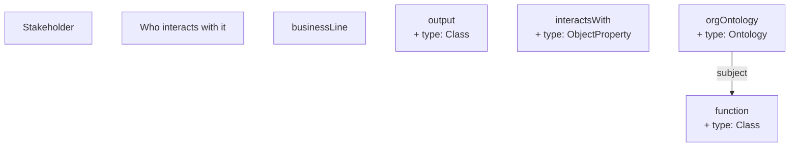

# Stakeholder

---

### Semantic Connections

```mermaid
graph TD
  Stakeholder["Stakeholder"]
  function["function<br>+ type: Class"]
  Who_interacts_with_it["Who interacts with it"]
  businessLine["businessLine"]
  output["output<br>+ type: Class"]
  interactsWith["interactsWith<br>+ type: ObjectProperty"]
  orgOntology["orgOntology<br>+ type: Ontology"]
  orgOntology-->|" subject "|function
```