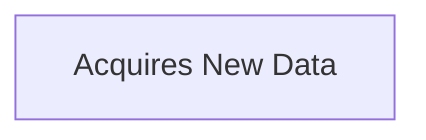

1. Do you have a process for assessing new data for  publication as an open asset? [[curates_open_data]]

## Semantic Connections

```mermaid
graph TD
  Acquires_New_Data["Acquires New Data"]:::current-page-node
```
