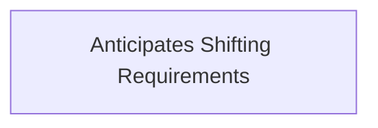

Anticipates and responds to shifting requirements including identifying new kinds, types, and sources of data.

## Semantic Connections

```mermaid
graph TD
  Anticipates_Shifting_Requirements["Anticipates Shifting Requirements"]:::current-page-node
```
