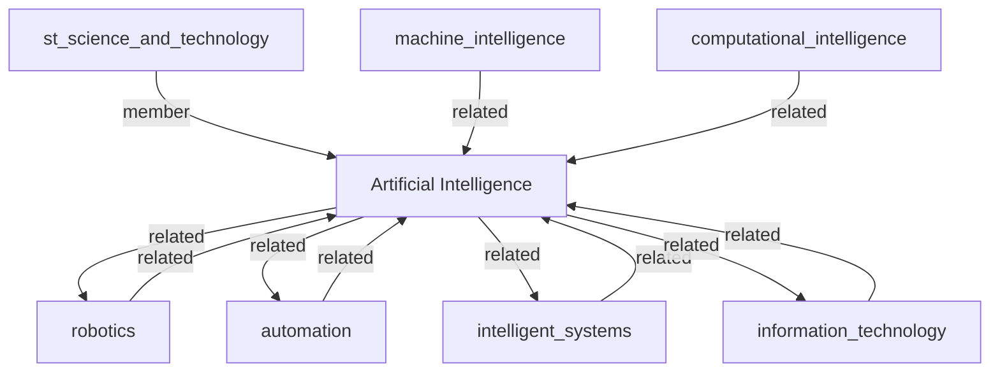

- [[st_science_and_technology]]

## Semantic Connections

```mermaid
graph TD
  Artificial_Intelligence["Artificial Intelligence"]:::current-page-node
  automation["automation"]
  information_technology["information_technology"]
  intelligent_systems["intelligent_systems"]
  robotics["robotics"]
  st_science_and_technology["st_science_and_technology"]
  computational_intelligence["computational_intelligence"]
  machine_intelligence["machine_intelligence"]
  st_science_and_technology-->|" member "|Artificial_Intelligence
  Artificial_Intelligence-->|" related "|robotics
  information_technology-->|" related "|Artificial_Intelligence
  machine_intelligence-->|" related "|Artificial_Intelligence
  Artificial_Intelligence-->|" related "|automation
  Artificial_Intelligence-->|" related "|intelligent_systems
  intelligent_systems-->|" related "|Artificial_Intelligence
  Artificial_Intelligence-->|" related "|information_technology
  computational_intelligence-->|" related "|Artificial_Intelligence
  robotics-->|" related "|Artificial_Intelligence
  automation-->|" related "|Artificial_Intelligence
```
