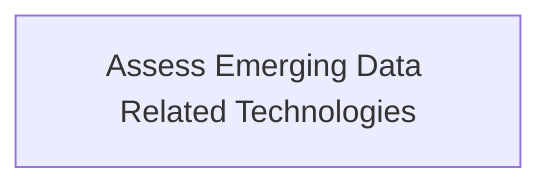

Collaborates with others to assess emerging data related technologies for usability, risks, and benefits

## Semantic Connections

```mermaid
graph TD
  Assess_Emerging_Data_Related_Technologies["Assess Emerging Data Related Technologies"]:::current-page-node
```
