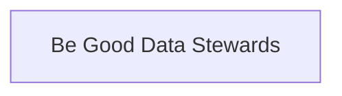

## What is Being Good Data Stewards?

> Being good data stewards means managing and protecting data responsibly, ensuring its accuracy, privacy, and security throughout its lifecycle. It involves being transparent about how data is used, maintaining its quality, and adhering to relevant laws, policies, and ethical standards. Good data stewardship also includes making data accessible and usable for those who need it while safeguarding it against misuse, including ensuring that non-sensitive data is made open, accessible and usable to the public in alignment with open government principles.[^1]

[^1]: [Be good data stewards - Canada.ca](https://www.canada.ca/en/government/system/digital-government/government-canada-digital-standards/be-good-data-stewards.html)

## Semantic Connections

