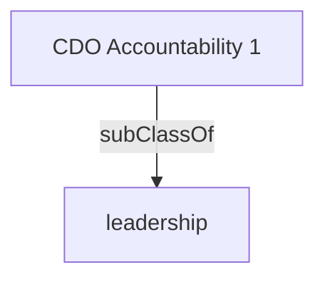

Directs the development and implementation of strategies, frameworks, policies, directives, standards and guidelines for an organization's information and data assets. Identifies and provides leadership on opportunities to enhance service delivery through data and automation. Leads the integrating governance of information and data functions in the organization's business planning, and program service deliver. Leads literacy efforts and promotes a professional and integrated approach to leveraging information and data across the enterprise and maximizing the release of departmental information and data as an open resource.'

## Related Links

- [[leadership]]

## Semantic Connections

