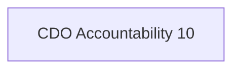

In collaboration with the Chief Technology Officer, directs research and development to enhance the usefulness of data assets including the application of artificial intelligence. Anticipates and responds to shifting requirements including identifying new kinds, types, and sources of data. Collaborates with others to assess emerging data related technologies for usability, risks, and benefits.

## Semantic Connections

