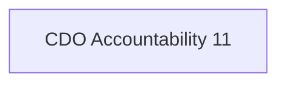

The Chief Data Officer (CDO) is accountable for the strategic management and the advancement of organizational information and data functions as a business asset.

## Semantic Connections

```mermaid
graph TD
  CDO_Accountability_11["CDO Accountability 11"]:::current-page-node
```
