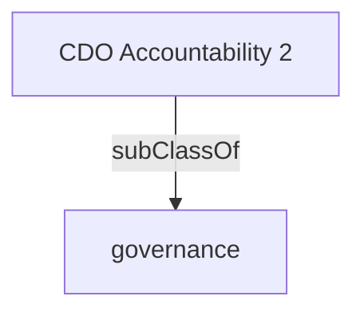

Leads the development of corporate, standards, and architectures that define govern and establishes departmental processes for the lifecycle management of enterprise information, data, analytics, and artificial intelligence models and algorithms.'

## Related Links

- [[governance]]

## Semantic Connections

