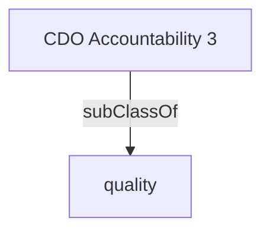

Directs the organization's data quality management and ethics to ensure accuracy, reliability, quality, and integrity. Ensures the organization's data assets are safeguarded by adhering to Government of Canada privacy protection and ethics standards and organizational cybersecurity policy.'- [[quality]]

## Semantic Connections

