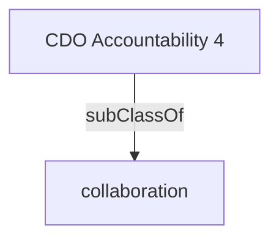

Establishes and maintains partnerships within the home organization and with relevant external organizations to share expertise, ensure alignment of information and data architectures that enable effective data sharing to optimize digital initiatives and service delivery.

## Related Links

- [[collaboration]]

## Semantic Connections

