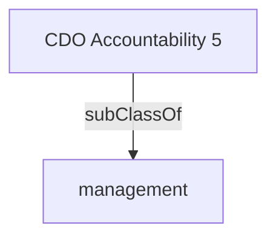

Builds and sustains the data office as a centre of excellence to develop and promote talent and ensures that its human and financial resources are managed with probity and efficiency and in a manner that supports the attainment of the overarching organization's goals and program priorities.- [[management]]

## Semantic Connections

