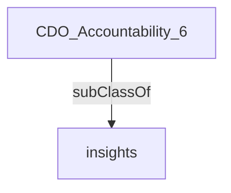

Leads the use and integration of data, analytics and research to support program delivery across the organization with relevant insights. Maximizes the strategic value of information and data by enabling sharing and analytical integration across traditional silos.'

## Related Links

- [[insights]]

## Semantic Connections

