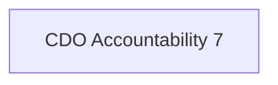

"Lead the business ownership of the organization's data and analytics platform. Directs the data architecture, development, design and implementation of the organization's data governance systems, programs, and repositories to ensure their interoperability, scalability, and maximum contribution to the mandate of the organization."

## Semantic Connections

