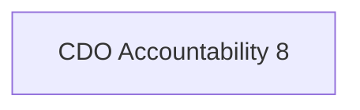

Establish and maintain data and information sharing between programs using approaches that ensure data is Findable, Accessible, Reusable (FAIR principles).'''

## Semantic Connections

```mermaid
graph TD
  CDO_Accountability_8["CDO Accountability 8"]:::current-page-node
```
