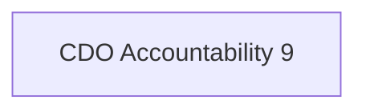

Lead the acquisition of new data, and the process of integrating new data sources. Leads data stewardship for existing data assets and curates public open data offerings in accordance with the National Action Plan on Open Government.

## Semantic Connections

