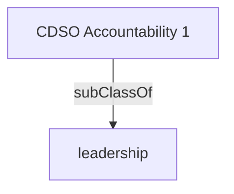

Leads the development, implementation, and enhancement of strategies, architectures, and governance structures to foster digital, connected, client-focused programs and services across the organization.- [[leadership]]

## Semantic Connections

