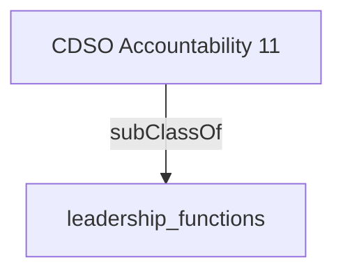

Communicates priorities and adjudicates disputes6 related to service delivery and the Digital Agenda* across the organization.''- [[leadership_functions]]

## Semantic Connections

```mermaid
graph TD
  CDSO_Accountability_11["CDSO Accountability 11"]:::current-page-node
  leadership_functions["leadership_functions"]
  CDSO_Accountability_11-->|" subClassOf "|leadership_functions
```
