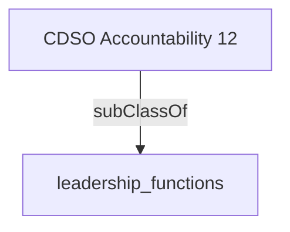

Establishes feedback loops, and champions the continuous improvement of the enterprise digital service infrastructure*.'

## Related Links

- [[leadership_functions]]

## Semantic Connections

```mermaid
graph TD
  CDSO_Accountability_12["CDSO Accountability 12"]:::current-page-node
  leadership_functions["leadership_functions"]
  CDSO_Accountability_12-->|" subClassOf "|leadership_functions
```
