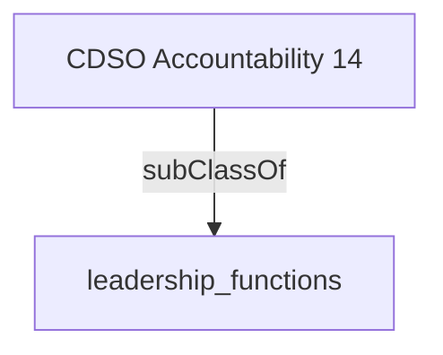

Implements a program to enhance and measure digital competency7 across the departmental workforce.'- [[leadership_functions]]

## Semantic Connections

```mermaid
graph TD
  CDSO_Accountability_14["CDSO Accountability 14"]:::current-page-node
  leadership_functions["leadership_functions"]
  CDSO_Accountability_14-->|" subClassOf "|leadership_functions
```
