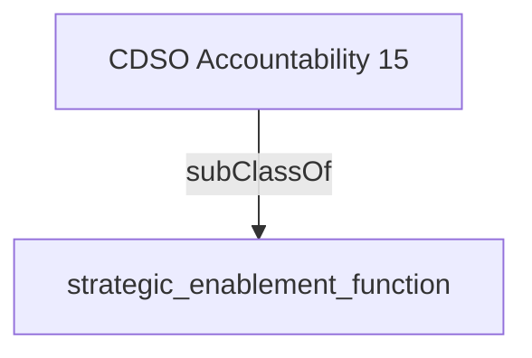

Documents and shares the most holistic architecture* view of the enterprise with a focus on how humans experience the processes that make up the architecture.'

## Related Links

- [[strategic_enablement_function]]

## Semantic Connections

