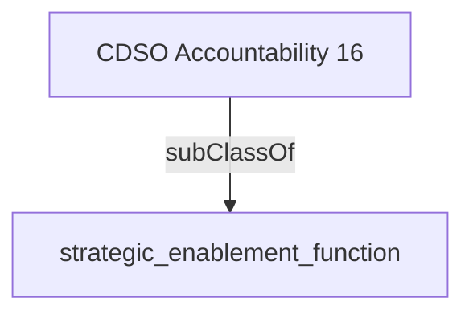

Maintains a departmental service inventory8 ensuring that every service has an identified owner and that service standards are developed, managed and regularly reviewed.''

## Related Links

- [[strategic_enablement_function]]

## Semantic Connections

