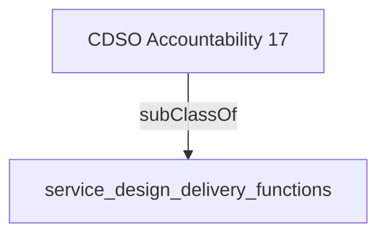

Ensures that experience design* is applied to address complex service delivery challenges and create human-centered outcomes.- [[service_design_delivery_functions]]

## Semantic Connections

```mermaid
graph TD
  CDSO_Accountability_17["CDSO Accountability 17"]:::current-page-node
  service_design_delivery_functions["service_design_delivery_functions"]
  CDSO_Accountability_17-->|" subClassOf "|service_design_delivery_functions
```
