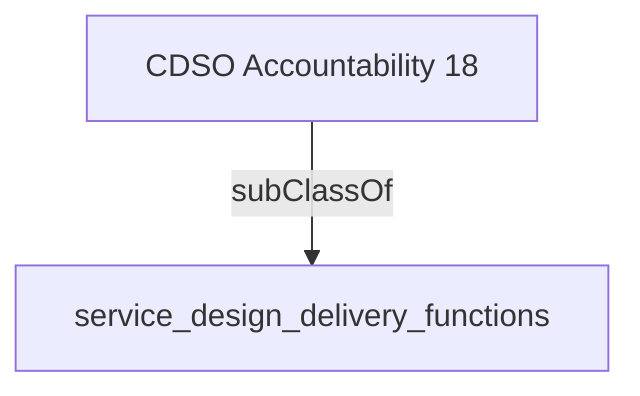

Directs collaboration between technology, architecture, data and program/service teams to design and deliver scalable and adaptable, client-centric (intuitive, inclusive and accessible), and secure, services & products that take advantage of the opportunities presented by emerging technologies.''

## Related Links

- [[service_design_delivery_functions]]

## Semantic Connections

