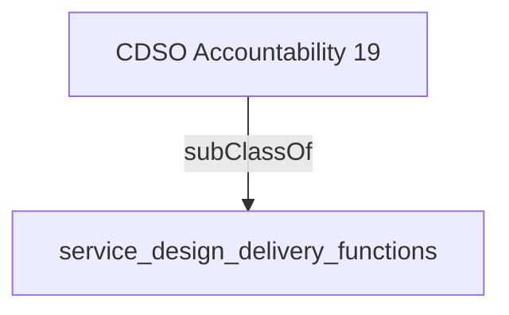

Works collectively (across government or service value chain) to reduce user burden, by creating, improving and re-using shared components to common service needs.- [[service_design_delivery_functions]]

## Semantic Connections

