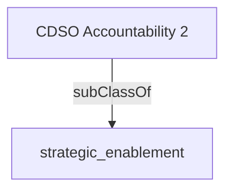

Directs alignment of departmental digital investments with government wide initiatives and service delivery partners to optimize interoperability and the human experience.  Ensures that across the enterprise, user adoption, experience and satisfaction data are consistently collected and shared to continuously improve services and products.- [[strategic_enablement]]

## Semantic Connections

