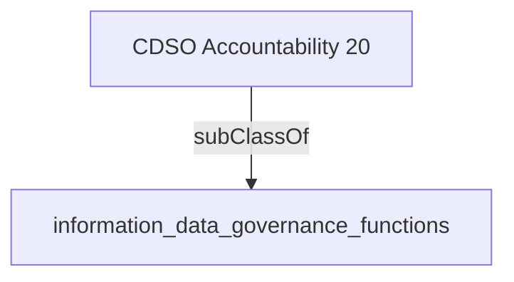

Oversees the strategic management of all information and data functions to advance the stewardship, interoperability and the ethical use of information and data across the organization.'- [[information_data_governance_functions]]

## Semantic Connections

