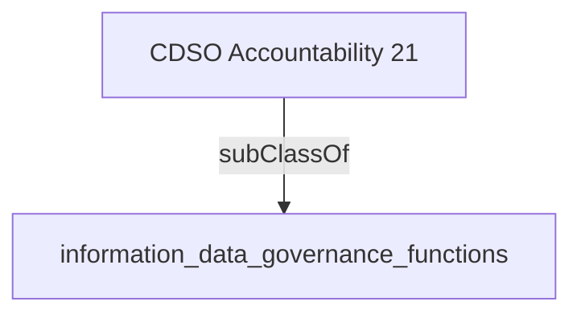

Directs the strategy and governance for the development, application and use of artificial intelligence models and algorithms in alignment with government-wide policy and direction.- [[information_data_governance_functions]]

## Semantic Connections

