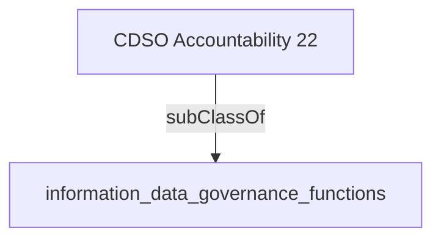

Collaborates and builds trust within federated structures such as departmental operations, services, policy, program, or regulatory development.'- [[information_data_governance_functions]]

## Semantic Connections

