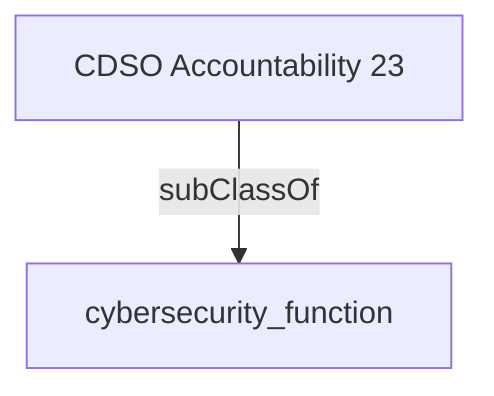

Works closely with the departmental Chief Security Officer and external partners including Treasury Board of Canada Secretariat (TBS), Shared Services Canada (SSC), the Canadian Centre for Cyber Security (CCCS) of the Communication Security Establishment (CSE), Public Safety, and Public Services and Procurement Canada (PSPC) to ensure a secure digital environment and protect the Government of Canada's network, information and data.

## Related Links

- [[cybersecurity_function]]

## Semantic Connections

