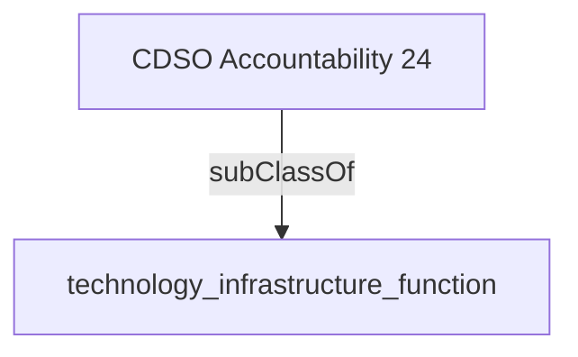

Enable the delivery of business and program innovation through related service agreements, vendor management and infrastructure configuration.

## Related Links

- [[technology_infrastructure_function]]

## Semantic Connections

