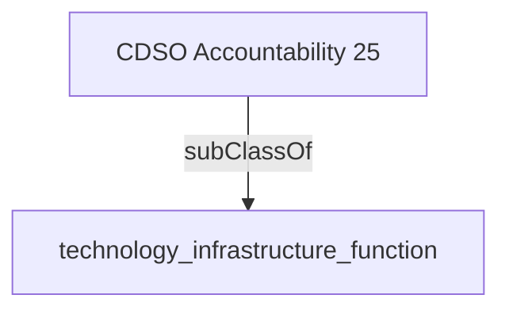

Provides strategic advice on technology investments.- [[technology_infrastructure_function]]

## Semantic Connections

```mermaid
graph TD
  CDSO_Accountability_25["CDSO Accountability 25"]:::current-page-node
  technology_infrastructure_function["technology_infrastructure_function"]
  CDSO_Accountability_25-->|" subClassOf "|technology_infrastructure_function
```
