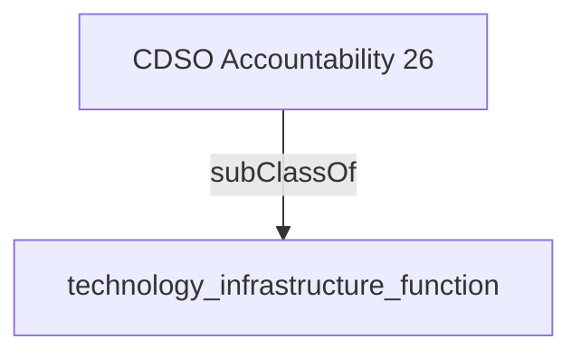

Advises on, and enforces departmental, government wide, and international standards as relevant.

## Related Links

- [[technology_infrastructure_function]]

## Semantic Connections

```mermaid
graph TD
  CDSO_Accountability_26["CDSO Accountability 26"]:::current-page-node
  technology_infrastructure_function["technology_infrastructure_function"]
  CDSO_Accountability_26-->|" subClassOf "|technology_infrastructure_function
```
