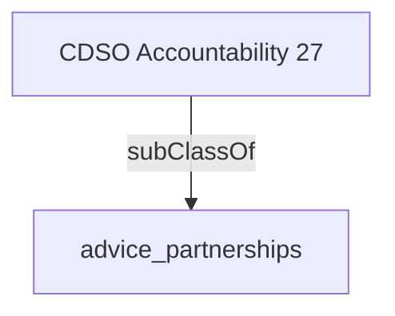

Provides expert strategic advice and recommendations to the Minister, Deputy Minister and senior management on all aspects relating to digital transformation of programs and services such as digital innovation, risk management, information and data management, technical operations concerning the impact on programs or initiatives in the organization.

## Related Links

- [[advice_partnerships]]

## Semantic Connections

