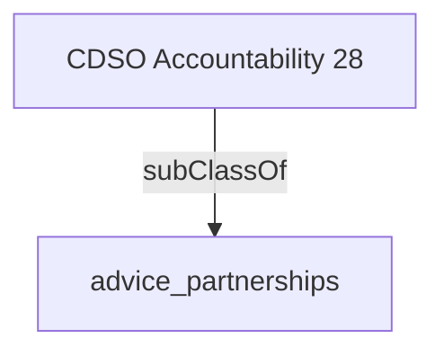

Provides outward facing representation of the Government's and organisation's vision, directions and strategies relating to digital transformation of programs and services.'- [[advice_partnerships]]

## Semantic Connections

