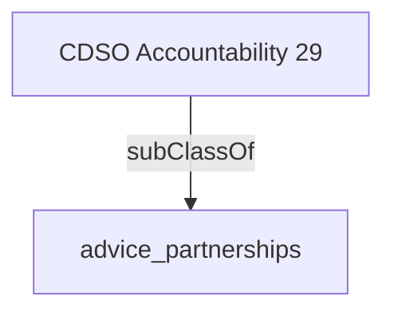

Oversees collaboration with partners such as other government data domain leads, central agencies, international organizations, private sector experts, indigenous, academia and third party service providers to advance the digital agenda.- [[advice_partnerships]]

## Semantic Connections

