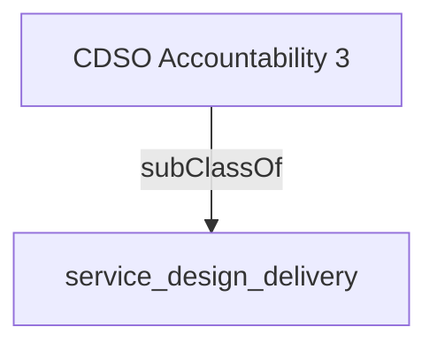

Directs enterprise-wide adoption of human-centred, connected digital services, enabled by a centre of excellence and knowledge network* focused on product management and service design, resulting in improved service outcomes and integration across the organization.

## Related Links

- [[service_design_delivery]]

## Semantic Connections

