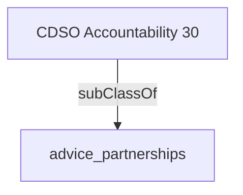

Actively partners with other CDSOs and digital leaders to explore opportunities for and prioritize investments for shared enterprise solutions for common problems.- [[advice_partnerships]]

## Semantic Connections

