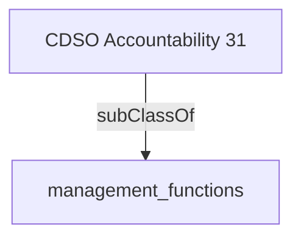

Fosters a self-sustaining Digital and Change Management culture within the department to drive long-term transformation.'

## Related Links

- [[management_functions]]

## Semantic Connections

```mermaid
graph TD
  CDSO_Accountability_31["CDSO Accountability 31"]:::current-page-node
  management_functions["management_functions"]
  CDSO_Accountability_31-->|" subClassOf "|management_functions
```
