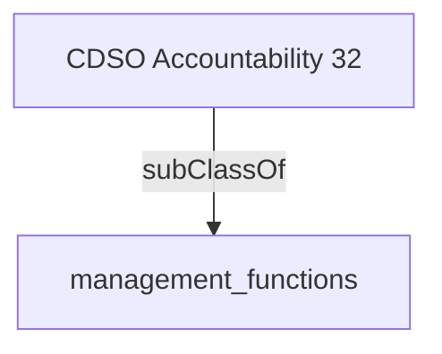

Oversees the management of human and financial resources with efficiency, integrity, and accountability.'

## Related Links

- [[management_functions]]

## Semantic Connections

```mermaid
graph TD
  CDSO_Accountability_32["CDSO Accountability 32"]:::current-page-node
  management_functions["management_functions"]
  CDSO_Accountability_32-->|" subClassOf "|management_functions
```
