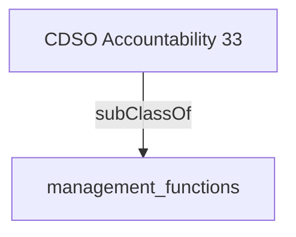

The CDSO works closely with colleagues in performance measurement, evaluation, and audit (PMEA) functions to share data and adopt common components to improve efficiency.'- [[management_functions]]

## Semantic Connections

