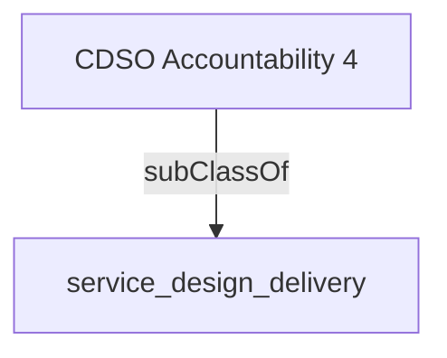

Ensures that enterprise digital services infrastructure enables effective information and data governance. (Note that this accountability cannot be delegated as it will involve directing the CDO and CTO).- [[service_design_delivery]]

## Semantic Connections

