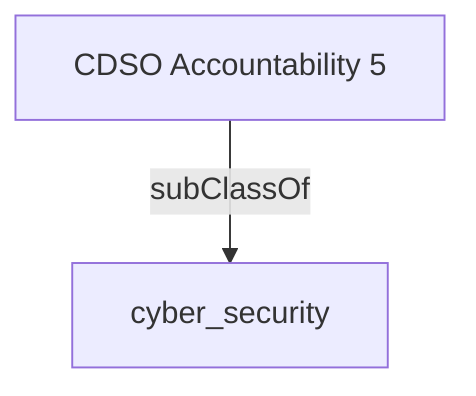

Oversees departmental cyber security and risk management measures, in accordance with the Departmental Security Plan (DSP), to prevent, detect, respond and recover from threats to IT systems and infrastructure to ensure the ongoing confidentiality, integrity and availability of information and data.

## Related Links

- [[cyber_security]]

## Semantic Connections

