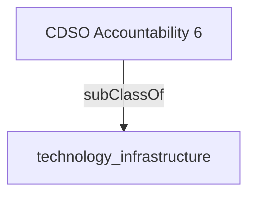

Oversees the delivery of, and day to day operations of the enterprise digital services infrastructure this includes prioritizing AI infrastructure

## Related Links

- [[technology_infrastructure]]

## Semantic Connections

