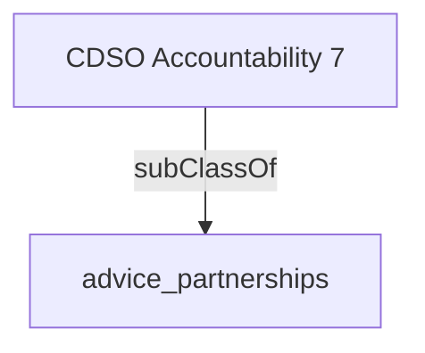

Advances whole-of-government digital transformation through strategic advice, partnerships, and collaboration.- [[advice_partnerships]]

## Semantic Connections

```mermaid
graph TD
  CDSO_Accountability_7["CDSO Accountability 7"]:::current-page-node
  advice_partnerships["advice_partnerships"]
  CDSO_Accountability_7-->|" subClassOf "|advice_partnerships
```
