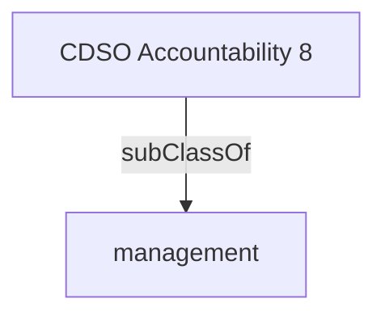

Oversees the management functions of the Chief Digital Service Officer unit to drive development and promotion of digital talent.

## Related Links

- [[management]]

## Semantic Connections

```mermaid
graph TD
  CDSO_Accountability_8["CDSO Accountability 8"]:::current-page-node
  management["management"]
  CDSO_Accountability_8-->|" subClassOf "|management
```
