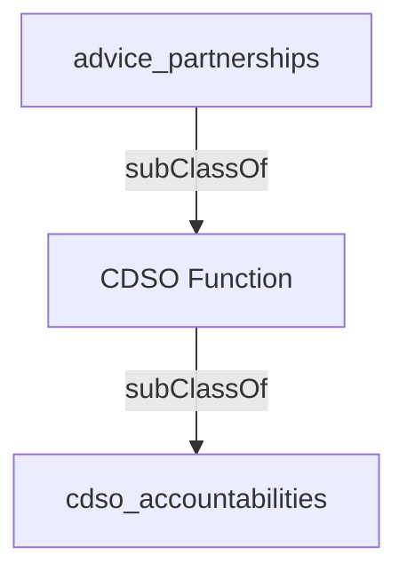

- [[advice_partnerships]]

## Semantic Connections

```mermaid
graph TD
  CDSO_Function["CDSO Function"]:::current-page-node
  cdso_accountabilities["cdso_accountabilities"]
  advice_partnerships["advice_partnerships"]
  CDSO_Function-->|" subClassOf "|cdso_accountabilities
  advice_partnerships-->|" subClassOf "|CDSO_Function
```
