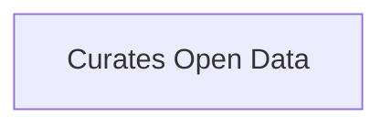

1. What are your open datasets? Provide the links.
2. What are their ratings stats?
3. Do you have schedule updating the open dataset?
4. Do you have a process for assessing disposition of an open dataset?

## Semantic Connections

