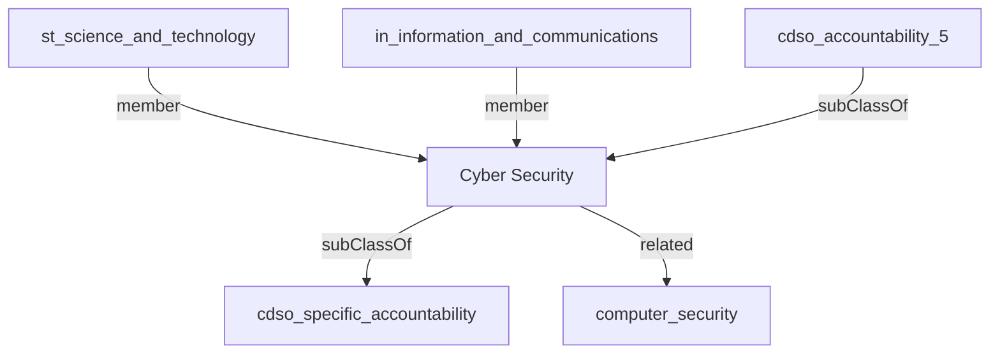

- [[st_science_and_technology]]

## Semantic Connections

```mermaid
graph TD
  Cyber_Security["Cyber Security"]:::current-page-node
  computer_security["computer_security"]
  cdso_specific_accountability["cdso_specific_accountability"]
  in_information_and_communications["in_information_and_communications"]
  st_science_and_technology["st_science_and_technology"]
  cdso_accountability_5["cdso_accountability_5"]
  st_science_and_technology-->|" member "|Cyber_Security
  in_information_and_communications-->|" member "|Cyber_Security
  Cyber_Security-->|" subClassOf "|cdso_specific_accountability
  cdso_accountability_5-->|" subClassOf "|Cyber_Security
  Cyber_Security-->|" related "|computer_security
```
